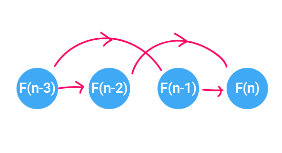

# Dynamic Programming 
[Introduction to Algorithms | Electrical Engineering and Computer Science | MIT OpenCourseWare](http://ocw.mit.edu/6-006F11)

- general and powerful
- algorithm design technique
- DP = careful brute force!
- sub-problems and “reuse”

### Fibonacci numbers
- F(1) = F(2) = 1
- F(n) = F(n-1) + F(n-2)
- goal : compute F(n)

#### Naive recursive algorithm

```js
fib(n) {
	if (n <= 2) return 1;
	// base case
	return fib(n-1) + fib(n-2);
	// recursive case
}
```

- very bad algorithm
- time complexity : O(2^n)  EXPONENTIAL TIME : T(n) = T(n-1) + T(n-2) + …..O(1)

#### Memoized DP algorithm

```js
function fib(n, memo) {
  var result;
  memo = memo || {};
	// make an empty dictionary called memo
  if (memo[n]) return memo[n];
  if (n <= 2) return 1;
  result = fib(n-1, memo) + fib(n-2, memo);
  memo[n] = result;
  return result;
}
```

	- `fib(k)`에서 k는 한번만 호출 되고 이후에는 `memo` 라는 dictionary에 저장된 memoized call을 사용
	- memoization time = constant(1)


- **memoize** (remember) and **reuse** solutions to **sub-problems** that help solve the problem.
- 작은 **sub-problem**의 결과를 기억하고 **재사용**해 전체 문제를 해결
- DP = Recursion + Memoization
- Time = sub-problems * (time / sub-problem = constant 1)

---

### Bottom-up DP algorithm

```js
function fib(n) {
  var table = [0,1];
  for (var i = 2; i <= n; i++) {
    table[i] = table[i-1] + table[i-2]
  }
  return table[n];
}
```

- exactly same computation ( as memoize solution)
- **topological sort** of sub-program dependency
- DAG
- safe space 
- linear time




---
