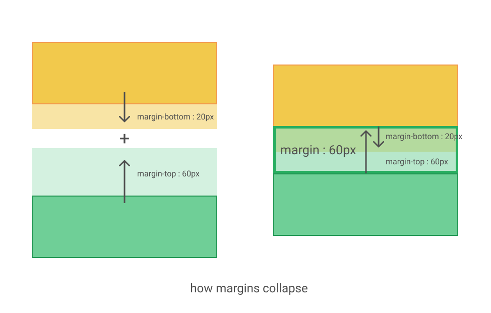

## What is margin collapsing?

When two elements are touching each other in a vertical way, margin collapsing occurs.

let's assume there are two box elements vertically aligned.
Box A - margin bottom : 20px 
Box B - margin top : 60px

It’s easy to think that the outcome would be 80px but that’s not correct. The resulting margin would be 60px.
**The largest margin remains the same and smallest margin collapses to 0.**
**Max(top margin, bottom margin)**

Margin collapsing only occurs when two(or more) top and bottom margins are touching, and it doesn’t happen at all with left and right margins.

## more about the margins
- More complex margin collapsing (of more than two margins) occurs when the above cases are combined.
- These rules apply even to margins that are zero, so the margin of a first/last child ends up outside its parent (according to the rules above) whether or not the parent's margin is zero.
- When negative margins are involved, the size of the collapsed margin is the sum of the largest positive margin and the smallest (most negative) negative margin.
- When all margins are negative, the size of the collapsed margin is the smallest (most negative) margin. This applies to both adjacent elements and nested element