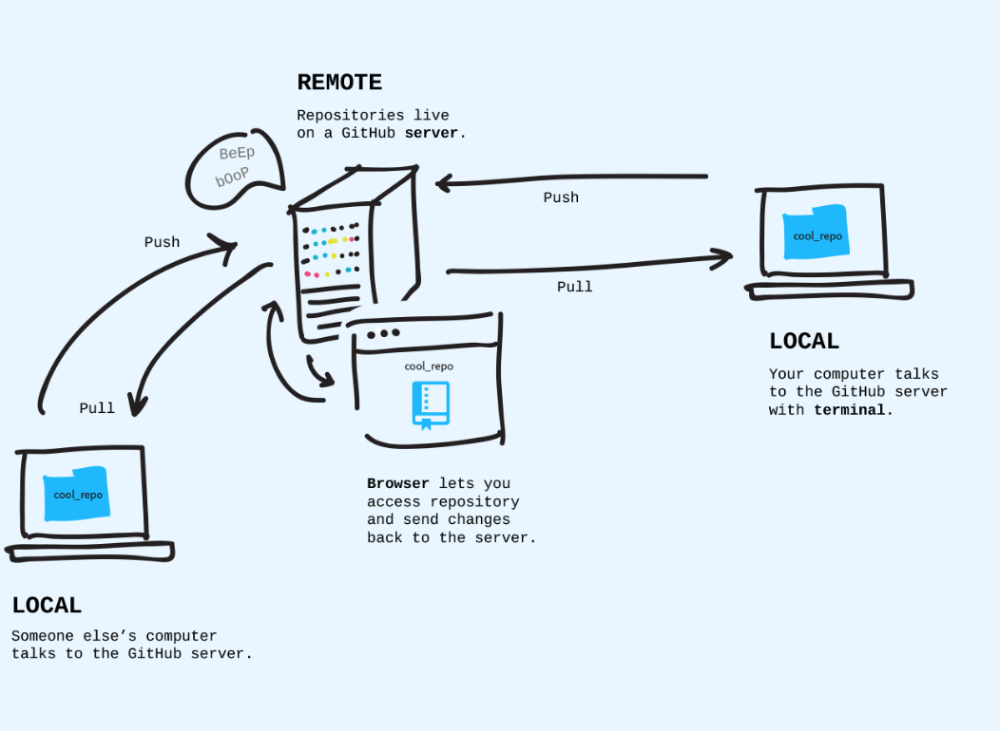
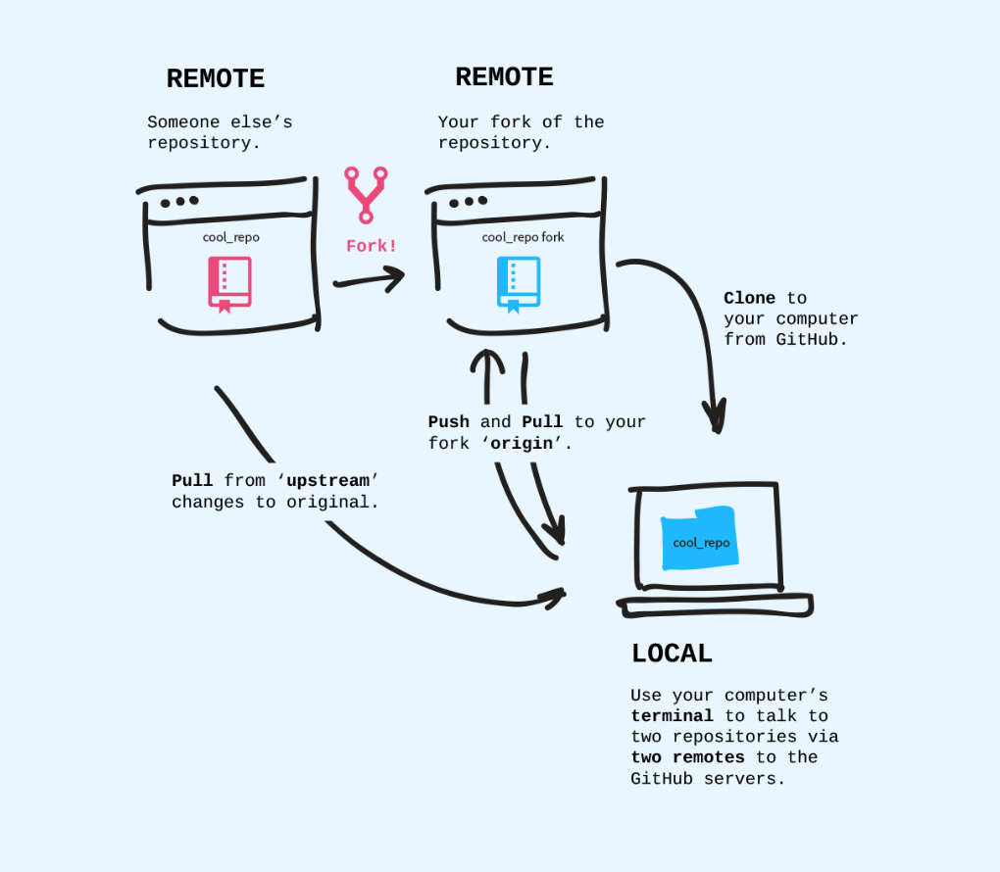
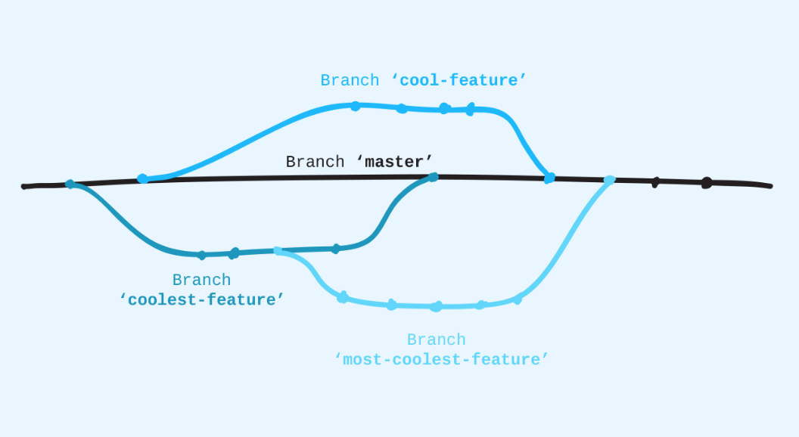
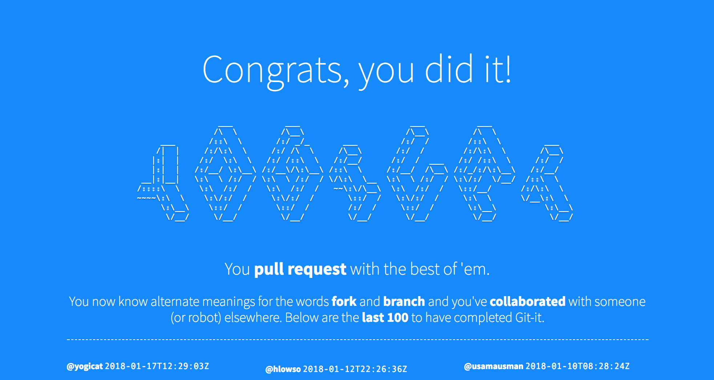

## Git-it

Funway to learn basics of Git : [GIT-IT](https://github.com/jlord/git-it-electron) 데스크탑용 앱을 다운받으면 쉽게 여러가지 git 명령어를 시도해보고 실제로 gitit에서 만든 github계정과 fork와 pull request 까지 해볼 수 있다.

### Tips

`$ git status`   check status
`$ git diff`   view changes to files
`$ git add readme.md`	add a file’s changes to be committed
`$ git commit -m "your message"` commit the changes
`$ git remote add origin <url>`   origin could me other name
`$ git remote set-url <remote name> <url>` 	set a URL to a remote
`$ git pull <remote name> <branch name>`
`$ git remote -v`	view remote addresses
`$ git push <remote name> <branch>`
`$ git checkout -b <branch-name>` create and switch to a branch (-b : branch)
`$ git branch <branch-name>` create new branch
`$ git checkout <branch-name>` move onto a branch
`$ git branch` list the branches
`$ git branch -m <new-branch-name>` rename a branch you're
`$ git merge <branchname>`
`$ git branch -d <branch-name>` delete a local branch
`$ git push <remote-name> --delete <branchname>` delete a remote branch
`$ git pull <remotename> <branchname>` pull from a remote branch

**readme.md** explains what the project is, how to use it, and so on.
**.gitignore** is a list of files that Git should not track, for instance, files with passwords.

### how git works

### forking

### branches

### Result
튜토리얼을 무사히 따라 마치면 이렇게 실제 사이트에 나의 아이디가 추가된다.

