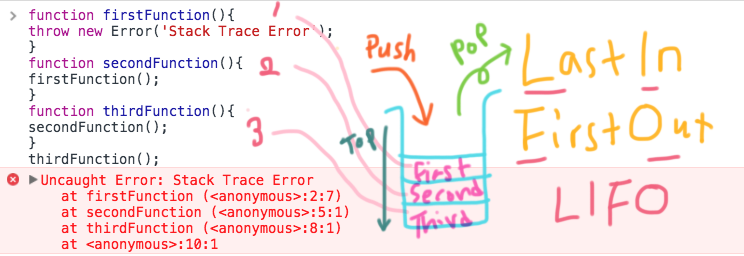

### Execution Context


> A call stack is a mechanism for an interpreter (like the JavaScript interpreter in a web browser) to keep track of its place in a script that calls multiple functions — what function is currently being run, what functions are called from within that function and should be called next, etc.

- When a script calls a function, the interpreter adds it to the call stack and then starts carrying out the function.
- Any functions that are called by that function are added to the call stack further up, and run where their calls are reached.
- When the main function is finished, the interpreter takes it off the stack and resumes execution it left off in the main code listing.
- If the stack takes up more space than it had assigned to it, it results in a "stack overflow" error.

> from MDN
 
---

브라우저 환경에서 볼 수 있는 자바스크립트 엔진은 'heap'과 단일의 'call stack'으로 이루어진 single-threaded interpreter이다.- 여기서 'Thread'(스레드)란, 프로그래밍이 실행되는 흐름의 단위를 말한다. 하나의 thread를 가지고 있으면 single thread, 여러개를 동시에 실행할 수 있으면 multithread라고 한다. 브라우저는 DOM, AJAX 그리고 타이머와 같은 web API를 제공한다.

콜스택에 대한 이해가 함수의 위계와 실행 순서의 동작 방식을 이해하는데 큰 도움이 될 것이다. 콜스택은 주로 함수호출(call)을 위해 사용되며 하나만 존재하기 때문에 함수의 실행은 하나씩 위에서 아래로 진행된다. -콜스택은 synchronous 라고 할 수 있다.

콜스택은 함수의 호출을 임시로 저장하고 관리하기 위한 LIFO방식의 데이터 구조이다. 

에러를 던져 실제로 콜스택이 어떻게 구성되는지 볼 수 있다.

```js
function firstFunction(){
throw new Error('Stack Trace Error');
}
function secondFunction(){
firstFunction();
}
function thirdFunction(){
secondFunction();
}
thirdFunction();
```




[Understanding the JavaScript call stack](https://medium.freecodecamp.org/understanding-the-javascript-call-stack-861e41ae61d4)