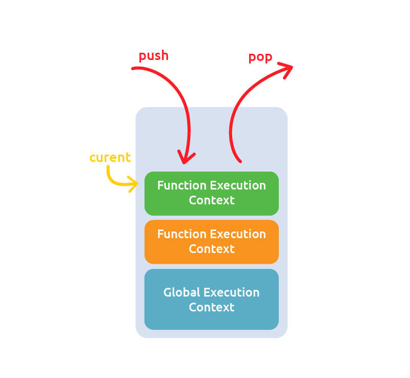

## Execution Context


**참고링크**

- [Understanding Javascript Function Executions](https://medium.com/@gaurav.pandvia/understanding-javascript-function-executions-tasks-event-loop-call-stack-more-part-1-5683dea1f5ec)
- [Understanding the JavaScript call stack](https://medium.freecodecamp.org/understanding-the-javascript-call-stack-861e41ae61d4)
- [Javascript Closures](http://jibbering.com/faq/notes/closures/#clScCh)
- [Identifier Resolution and Closures in the JavaScript Scope Chain by David Shariff](http://davidshariff.com/blog/javascript-scope-chain-and-closures/)
- [What is the Execution Context & Stack in JavaScript? by David Shariff](http://davidshariff.com/blog/what-is-the-execution-context-in-javascript/)
- [Writing Efficient JavaScript: Chapter 7 - Even Faster Websites - O’Reilly Media](http://archive.oreilly.com/pub/a/server-administration/excerpts/even-faster-websites/writing-efficient-javascript.html)
- [JavaScript closure vs. object look-up performance](http://marijnhaverbeke.nl/blog/closure-vs-object-performance.html)
- [Why the V8 Javascript Engine is so good - Developer Knowhow](http://www.developerknowhow.com/995/why-the-v8-javascript-engine-is-so-good)
- [ECMA-262-3 in detail. Chapter 4. Scope chain. – .ds laboratory](http://dmitrysoshnikov.com/ecmascript/chapter-4-scope-chain/)


---

자바스크립트에서 코드가 실행되어지는 환경이 굉장히 중요하다. 이 환경은 아래중 한개로 결정된다.

- Global code : 기본 환경으로 가장 처음 코드가 실행되는 곳이다.
- Function code : 실행 흐름이 함수의 몸체로 들어오면 실행되는 곳이다.
- Eval code : eval 함수 실행시 환경

---

### `global context` and `function contexts`

- 프로그램 내에 하나의 global context를 가진다.
- global context는 다른 컨텍스트들에 의해 접근가능하다.
- 무제한의 `function contexts`를 가질 수 있다.
- 각각의 함수 호출은 각각의 새로운 컨텍스트를 형성한다.
- `function contexts`는 프라이빗 스코프를 형성한다. 


### Execution Context Stack


> A call stack is a mechanism for an interpreter (like the JavaScript interpreter in a web browser) to keep track of its place in a script that calls multiple functions — what function is currently being run, what functions are called from within that function and should be called next, etc.

- When a script calls a function, the interpreter adds it to the call stack and then starts carrying out the function.
- Any functions that are called by that function are added to the call stack further up, and run where their calls are reached.
- When the main function is finished, the interpreter takes it off the stack and resumes execution it left off in the main code listing.
- If the stack takes up more space than it had assigned to it, it results in a "stack overflow" error.

> from MDN
 
---

크롬 브라우저 환경에서 볼 수 있는 자바스크립트 엔진은 단일의 'call stack'으로 이루어진 single-threaded interpreter이다.- 여기서 'Thread'(스레드)란, 프로그래밍이 실행되는 흐름의 단위를 말한다. 하나의 thread를 가지고 한번에 하나씩 실행하는 경우를 single thread, 여러개를 동시에 실행할 수 있으면 multithread라고 한다.

콜스택에 대한 이해가 함수의 위계와 실행 순서의 동작 방식을 이해하는데 큰 도움이 될 것이다. 콜스택은 주로 함수호출(call)을 위해 사용되며 하나만 존재하기 때문에 한번에 하나의 테스크(task)를 위에서 아래로 진행된다. -콜스택은 synchronous 라고 할 수 있다.

콜스택은 함수의 호출을 임시로 저장하고 관리하기 위한 LIFO방식의 데이터 구조이다. 

---


브라우저 내의 자바스크립트 인터프리터는 싱글스레드 방식으로 실행된다. 브라우저에서는 한번에 한가지 일만 일어날 수 있고, 이때 실행되는 컨텍스트는 `execution stack`, `call stack`에 쌓여서 위에서부터 순차적으로 진행된다.

가장 먼저 브라우저가 스크립트를 가져오면, 기본 환경 값인 `global execution context` 환경으로 들어간다. 

이 안에서 함수를 호출하면 실행의 흐름은 함수로 들어가게되고 이때 stack에 `function context`가 `global execution context`위로 push되어 쌓인다. 브라우저는 항상 스택의 가장 위에 쌓인 현재의 `execution context`를 실행하고, 실행이 끝나면 그 `execution context`는 stack에서 popped off(빠져나가게)되고 아래 위치한 context로 실행이 옮겨간다. 



---

`execution context stack`의 특징은 다음과 같이 정리할 수 있다.

- Single threaded
- Synchronous Execution
- One Global context
- Infinite function contexts
- each function call creates a new `execution context`


함수가 호출될 때마다 새로운 `execution context`가 생성되는데 이때 2단계를 거친다.

1. Creation Stage - 호출되고 실행 직전에
  - Scope Chain을 생성한다
  - variables, functions, arguments를 생성한다
  - 'this' 가 가리키는 값을 결정한다

2. Activation / Code Execution Stage 
  - 값 또는 참조값을 할당한다.
  - 코드를 실행한다


---


에러를 던져 콜스택이 어떻게 구성되는지 볼 수 있다.

```js
function firstFunction(){
throw new Error('Stack Trace Error');
}
function secondFunction(){
firstFunction();
}
function thirdFunction(){
secondFunction();
}
thirdFunction();
```

---


크롬 콘솔로 찍어보면 다음과 같이 나온다.
콜스택이 `firstFunction()` -> `secondFunction()` -> `thirdFunction()` 순으로 되있을 걸 볼 수 있다.


---

자바스크립트 코드가 실행될 때, Execution Context(실행컨텍스트)가 생성된다. Execution Context는 코드가 실행되는 환경을 정의한다. 
`Global Execution Context`는 페이지 로드될때 생성되고 이외에 `execution context`는 함수가 실행될 때 함께 생성된다.
각각의  `execution context`는 식별자(변수, 함수이름)의 결정을 위해 사용되는 `scope chain`을 가지고 있다. 
스코프 체인은 한개 이상의 `Variable Object`를 가지고 있고 이는 실행 컨텍스트의 스코프내의 식별자를 정의하는 역할을 한다.
Global execution context는 본인의 스코프 체인안에 단 하나의 variable object를 가지고 있고 이 객체는 자바스크립트 내에 사용 가능한 전역 변수, 함수를 정의한다. 

함수가 생성될 때(실행되기 이전), 함수의 내부에 [[Scope]]라는 프로퍼티는 실행 컨텍스트의 스코프 체인을 포함하도록 할당 받는다
나중에 실행의 흐름이 함수로 들어가면, activation object(variable object)가 형성되고 this, arguments, 로컬 variables 들로 초기값이 설정된다. activation object는 스코프 체인내에 첫번째로 보여지고 함수의 scope 프로퍼티안에 객체가 다음으로 보여진다.
코드 실행시, 변수나 함수이름과 같은 식별자들은 실행 컨텍스트의 스코프 체인을 찾아 결정된다. 식별자의 분석은 스코프체인의 앞에서 시작되고 뒤로 진행된다.
위의 코드가 실행될 때, `add` 함수는 오직 global variable object만을 포함하는 [[scope]] 프로퍼티를 가지고 있다. 함수로 실행이 옮겨지면, 새로운 실행컨텍스트가 생성되고 this, arguments, num1, num2를 포함한 activation object가 스코프 체인에 저장된다. 
`add`함수 내부에 식별자 num1과 num2는 함수가 실행될때 해석,결정,분석,해결 될 필요가 있다. 이 결정은 스코프 체인안에 각각의 객체를 검사함으로써 이루어 진다.  이 검색은  스코프체인의 가장 첫번째 객체인 로컬변수를 포함하고 있는 activation object 에서 부터 시작된다. 식별자를 찾지 못하면, 스코프 체인의 다음 객체로 옮겨가 검색을 진행한다. 식별자가 발견되면 검색은 중단된다. 
식별자 num1 과 num2는 로컬 activation object에 존재함으로 global object까지 올라가지 않는다.


---

- 실행컨텍스트의 스코프체인은 어떻게 형성 되는가?
- 실행 컨텍스트의 AO객체를 [[scope]]프로퍼티안에 저장된 스코프체인의 상위에 놓음으로써 형성된다.
- Function 생성자로 만들어지는 함수객체는 항상 [[scope]]프로퍼티를 가진다.
- 이 [[scope]]프로퍼티는 글로벌오브젝트만을 가지고 있는 스코프 체인을 참조한다.
- 함수 선언 혹은 함수 표현식으로 생성된 함수는 자신이 생성된 실행컨텍스트의 스코프체인을 가지고 있다.
- 이 스코프 체인은 내부 [[scope]]프로퍼티에  할당되어 있다.


---

