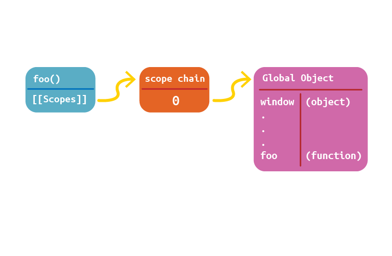

## understanding Scope

execution context의 scope 개념을 나만의 언어로 다시 정리해보자.

**참고 자료**
- Book : Hight Performance Javascript
- [David Shariff](http://davidshariff.com/blog/what-is-the-execution-context-in-javascript/)
- [David Shariff](http://davidshariff.com/blog/javascript-scope-chain-and-closures/#first-article)

---

Every function in Javascript is represented as an object - more specifically, as an instance of Function. Function objects have properties just like any other object, and these include both the properties that you can access programmatically and a series of internal properties that are used by the JavaScript engine but are not accessible through code. One of these properties is `[[Scope]]`, as defined by ECMA-262, Third Edition.

The internal `[[Scope]]` property contains a collection of objects representing the scope in which the function was created. This collection is called the function's scope chain and it determines the data that a function can access. Each object in the function's scope chain is called a variable object, and each of these contains entries for variables in the form of key-value pairs. When a function is created, its scope chain is populated with objects representing the data that is accessible in the scope in which the function was created.

---

자바스크립트의 모든 함수는 객체로 나타내어진다.--정확히 말하면, Function 의 인스턴스 객체이다. 함수 객체는 다른 객체과 같이 property를 가진다. 접근 가능한 프로퍼티 외에도 자바스크립트 엔진에 의해 사용되어지는 코드로 접근할 수 없는 내부 프로퍼티가 있다. 그중 하나가 [[Scope]] 프로퍼티 이다.

함수 내부의 [[Scope]]프로퍼티는 객체들의 집합(함수가 생성된 스코프를 가리키는)을 포함하고 있다.이 객체들의 집합을 다른말로 함수의 **스코프 체인**이라고 하고, 스코프체인은 함수가 접근 할 수 있는 데이터를 결정한다. 
함수의 스코프 체인안에 있는 각각의 객체를 **Variable Object(VO)**라고 하고, 각각의 VO는 변수의 정보를 key-value의 형태로 포함하고 있다.

---