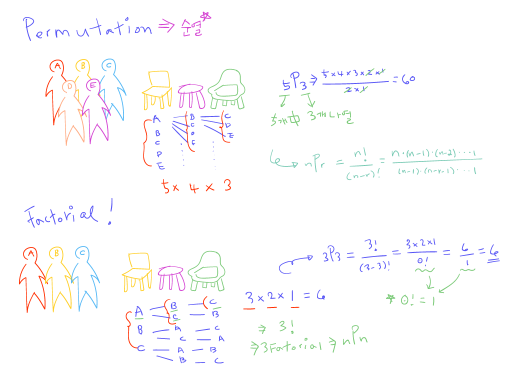
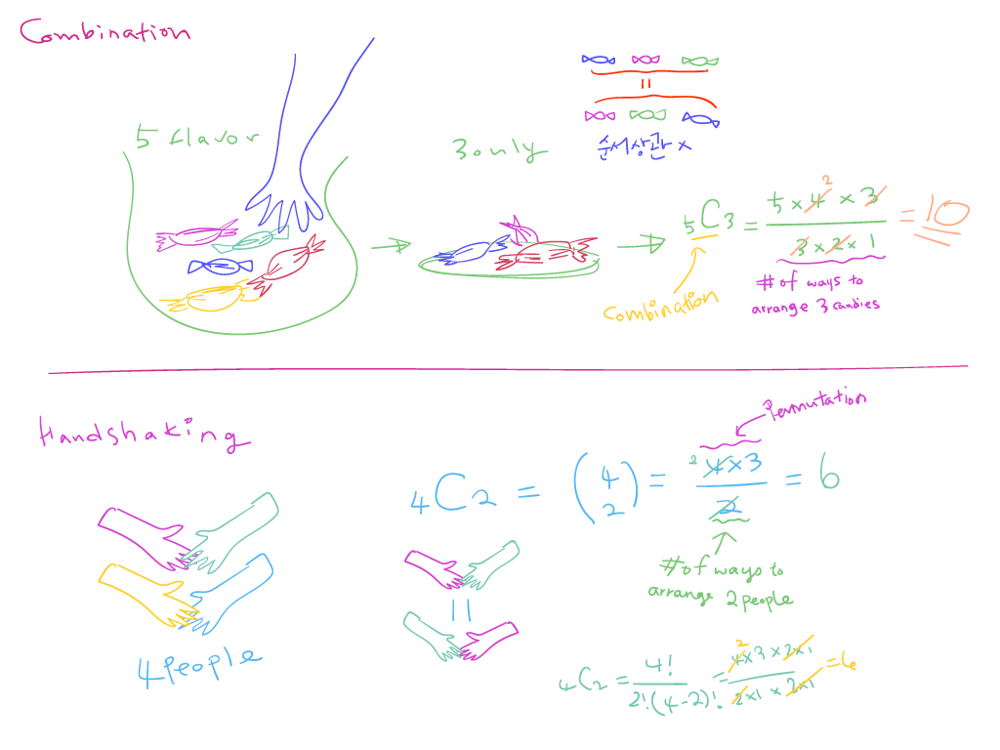

## Statistics and Probability

### Counting, permutations, and combinations

경우의 수를 구할때 2가지 중요한 개념에 대해 알아보자.

- 순열 (Permutation)
  - 서로 다른 n개에서 서로 다른 r개를 선택하여 일렬로 배열하는 것을 n개에서 r개를 택하는 순열 이라고하고, 기호로 `nPr`로 나타낸다.
  - 순서가 중요한 경우 (자리배정, 숫자조합, ...)

- 조합 (Combination)
  - 서로 다른 n개에서 순서를 생각하지 않고 r개를 택하는 것을 n개에서 r개를 택하는 조합이라 하고, 이 조합은 `nCr`로 나타낸다.
  - 순서가 중요하지 않은 경우 (대표선발, 악수, ...)

---

---

#### quiz

1. How many unique ways are there to arrange the letters in the word 'DEN'?

  - 첫번째 올 수 있는 캐릭터 3개 * 두번째 올 수 있는 캐릭터 2개 * 1 = 6가지

2. You have 4 reindeer, Baithazar, Quentin, Jebediah, and Prancer, and you want to have 3 fly your sleigh. You always have your reindeer fly in a **single-file line**. 

How many different ways can you arrange your reindeer?

  - 4마리 중 3마리를 골라야 한다 -> 일렬로 탄다 -> 순서중요 -> 순열
  - 4 * 3 * 2 * 1 = 24 -> 24 / 1 = 24가지 방법

3. You just got a free ticket for a boat ride, and you can bring along 2 friends. Unfortunately, you have 5 friends who want to come along.

How many different groups of friends could you take with you?

  - 순서 중요하지 않으므로 조합 -> 5명 중 2명 선택
  - 5명 중 2명 의 순열 / 2명의 경우의 수 -> ( 5 * 4 ) / ( 2 * 1 ) -> 10가지 방법

3. Michael is packing his bags for his vacation. He has 6 unique books, but only 4 fit in his bag.

How many different groups of 4 books can he take?

  - 6개 중 4개의 조합 
  - ( 6 * 5 * 4 * 3 ) / ( 4 * 3 * 2 * 1) = 15가지의 수

4. How many unique ways are there to arrange the letters in the word 'PRIOR'?
  
  - 5 * 4 * 3 * 2 * 1 = 120 
  - 5개의 캐릭터 중 R이 두개 -> 2개의 경우의 수 2!
  - 120 / 2 = 60가지

