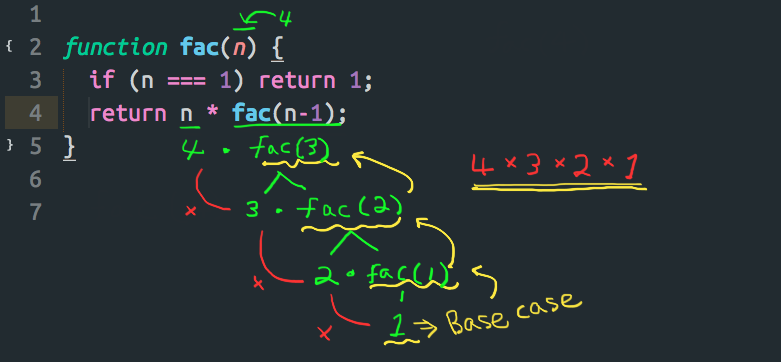
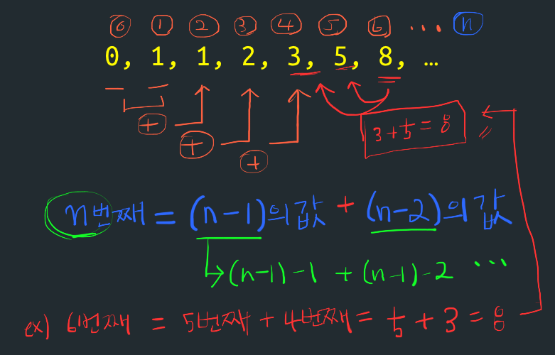
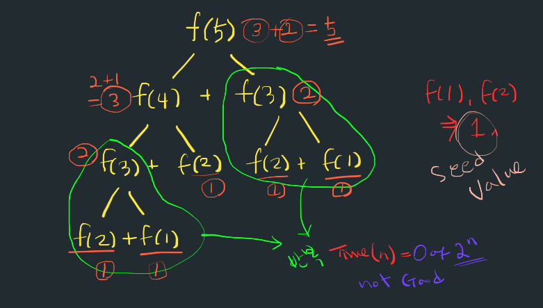

## Recursion
알고리즘을 풀다가 알게된 recursion에 대해 공부해 보았다. 
이론은 Mit open course - 컴퓨터 공학 6.0001 강의와 하버드 CS50 리소스, 위키피디아, 그리고 Khan Academy를 참고했다. 

- - - -

### What is Recursion
- 재귀, 귀납 
- 자신을 정의할 때 자기 자신을 재참조하는 방법
- 문제를 작은 부분으로 쪼개서 그 부분의 해결에 의해서 전체를 해결하는 방법 
- 하노이의 타워 (Tower of Hanoi)

Recursion은 어릴때 봤던 러시아 인형처럼 계속해서 작은 버젼의 인형이 더이상 작아질 수 없을 때까지 나오는 그런 것과 비슷한 개념이다. 

대부분의 컴퓨터 프로그래밍 언어는 자기 자신을 호출 알 수 있는 재귀를 허용 한다. 일반적인 접근 방법은, 전체 문제를 그 문제와 같은 방식의 작은 ‘sub-problem’으로 나눈다. 이 ‘sub-problem’을 해결한 결과들을 합친다. 이를 **divide and conquer** 라고 하기도 하고 이는 **dynamic programming** 혹은 **memoization**이라고 하기도 한다.

- - - -

재귀함수는 한개이상의 **base case**와 **recursive case**를 가지고 있다. 
- Base case는 더이상 반복하지 않고(재귀하지 않고)  결과를 내게 하는 일종의 함수가 끝나는 지점 혹은 영어로는 ‘terminating case’ 를  정의하는 부분
- Recursive case는 반복적으로 수행할 연산을 정의하는 부분

- - - -

### Multiplication 문제 풀기

- a 를 b번 만큼 반복해서 더하는 함수 만들기 
- a + a + a + a … a  = a * b


### Iterative Solution

- for loop 이나 while 반복문을 사용한 해결

```js
// a를 b번 만큼 반복해서 더해라
function mult_iter(a, b) {
  var result = 0;
  while (b > 0) {
    result += a;
    b--;
  }
  return result;
}

mult_iter(5, 3);
// 5 + 5 + 5 = 15

```

- - - -


### Recursive Solution


```js
function mult(a, b) {
  if (b === 1) return a;
  return  a + mult(a, b-1);
}

mult(5, 3);
// 15
```

- - - -

### Factorial 문제 풀기
- n ! = n * (n-1) * (n-2) * (n-2) * … * 1
- Base Case : n = 1 일때 1



```js
function fac(n) {
  if (n === 1) return 1;
  return n * fac(n-1);
}

fac(3);
```

- - - -
### Fibonacci 문제 풀기

- 피보나치 수는 0과 1로 시작하며, 다음 피보나치 수는 바로 앞의 두 수의 합이 된다.
- n의 피보나치수는 (n-1)의 피보나치수 + (n-2)의 피보나치수와 같다 
- seed value : 0 일때 혹은 1일때 결과값은 1이다. 





```js
function fibo(n) {
  if (n === 0 || n === 1 ) return 1;
// 0, 1 일때는 1을 리턴한다. 
  return fibo(n-1) + fibo(n-2); 
}

fibo(2);
fibo(3);
fibo(4);
fibo(5);
fibo(6);

```



- - - -


### Fibonacci - Memoization이용해 문제 풀기

- 위에 recursion을 사용하면, recursion내에서 겹치는 부분이 발생한다.
- 겹치는 부분을 저장해 놓고 가져다 쓴다

```js
function fibo2(n, memo) {
  var result;
  memo = memo || {};
  if (memo[n]) return memo[n];
  if (n <= 2) return 1;
  result = fibo2(n - 1, memo) + fibo2(n - 2, memo);
  memo[n] = result;
  return result;
}

console.log(fibo2(2));
console.log(fibo2(3));
console.log(fibo2(4));


```

memo라는 기억할 저장소를 만들어 놓고, recursion할 때마다 그 값을 저장해 둔다, 나중에 똑같은 값에 대한 recursion이 필요할때 저장소에서 먼저 찾아 보고 없을 경우에만 recursion을 실행한다.