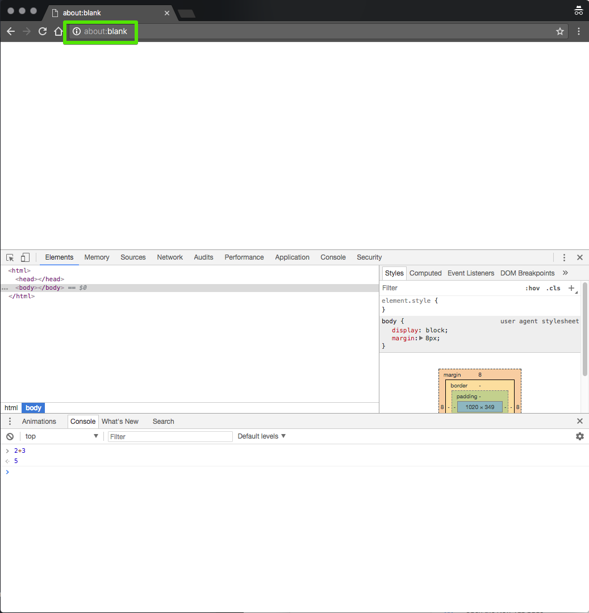

## use Empty Tab to use dev-tools

use Chrome Dev Tool with **blank page.**

- type `about:blank` into the address bar and it will open blank page.
- very useful when you just want to use console for simple test.

