### github에 도메인 https로 연결하기

개인 도메인과 깃헙블로그를 연결하고 https로 접속할 수 있는 방법을 알아보자. 
기본 준비 사항은 다음과 같다. 

1. 도메인 - goDaddy, nameCheap, bluehost,... 
2. 아이디. github.io로 접속할 수 있는 블로그 사이트 

연결 절차는, 
1. 깃허브에 도메인을 연결한다. 
2. Cloudflare에 가입한 뒤 도메인을 연결한다. 
3. 도메인을 구입한 사이트로 가서 Nameserver를 Cloudflare로 연결한다. 
4. 잠시 후 https로 접속해본다! 

인증을 받기 위해서는 인증기관을 거쳐야 하는데 **[Cloudflare](https://www.cloudflare.com/)**사이트를 통하면 손쉽게 무료로 인증을 받을 수 있다. [Cloudflare](https://www.cloudflare.com/)는 도메인 관리 서비스를 제공 기업으로, https을 위한 기능 외에도 브라우저 캐시 기간 설정 등 사이트 최적화를 위한 다양한 기능들을 제공한다.
- - - -
### step 1. 도메인과 깃헙 페이지를 연결한다

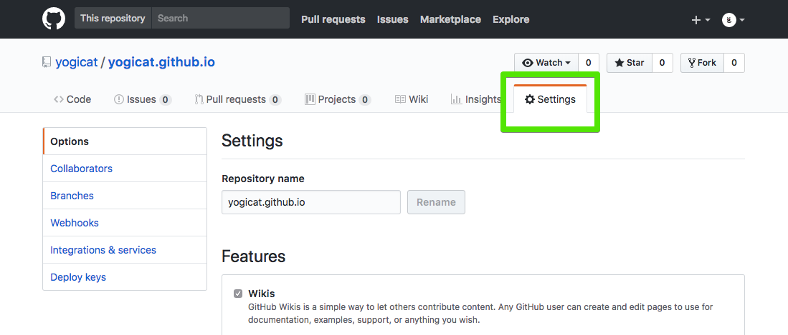
- 깃헙 블로그가 만들어진 repository의 세팅메뉴로 이동한다.

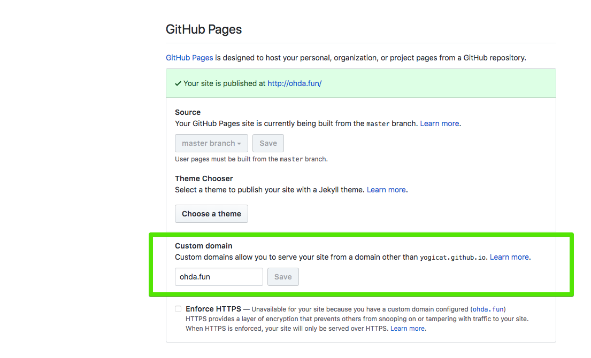
- 하단에 GitHub Pages로 이동해 Custom domain 입력창에 구매한 도메인 주소를 적는다.
- 이때 Enforce HTTPS가 비활성화되는 것을 볼 수 있다. 이는 `id.gitHub.io`를 사용할 때 선택할 수 있는 옵션으로 개인적으로 구매한 도메인은 따로 인증을 해줘야 한다.  다음 단계를 통해 인증을 해보자.

### step 2 . Cloudflare에 가입하기.

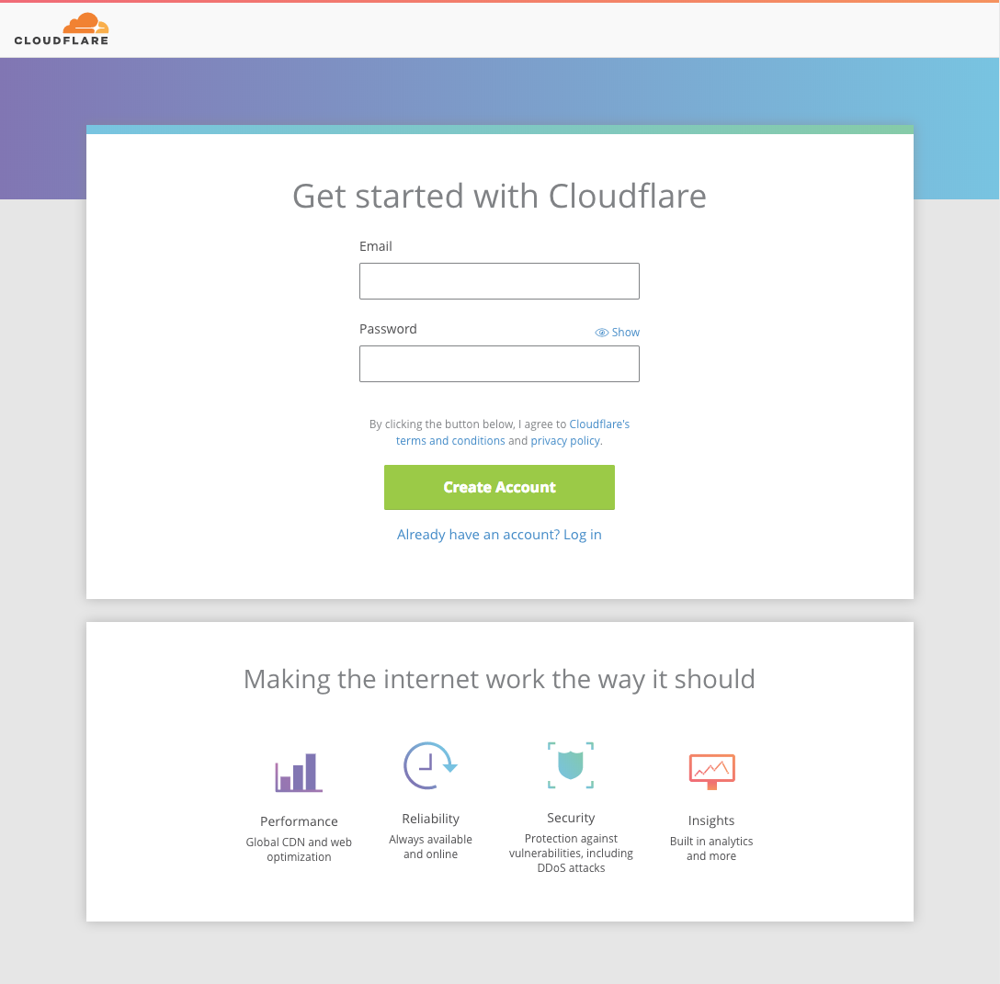
- 링크로 가서 무료 회원가입을 한다. [Cloudflare](https://www.cloudflare.com/)

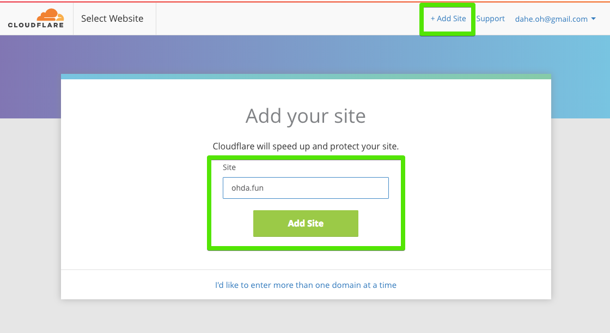

- 로그인을 하고 상단에 **+Add Site**를 선택한다
- 개인도메인 주소를 입력한다.

- 무료 버전을 선택한다

### step3. DNS 레코드 세팅하기

- Cloudflare에 가입과 도메인 연결에 성공하면 DNS Records 페이지가 나타난다.

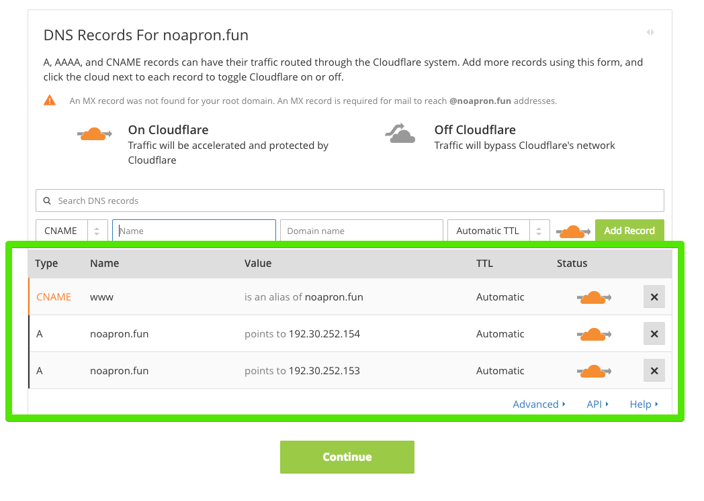
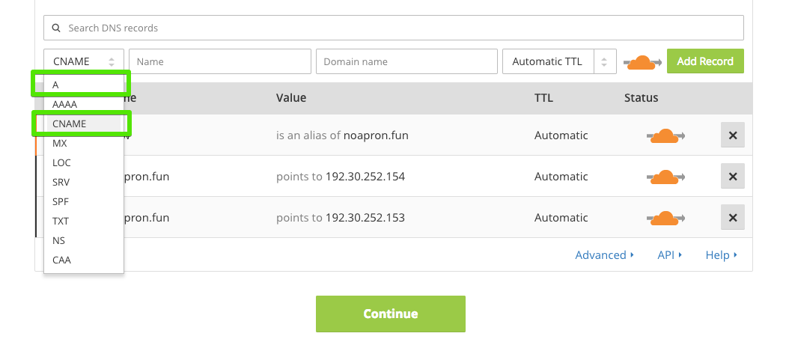

- 총 3개의 레코드를 작성한다.
- 깃헙 서버 주소로 연결할 2개의 A 레코드와 www 접속을 연결해줄 1개의 CNAME 레코드를 입력한다.
- A 레코드 연결시, Name에는 도메인주소를 Value에는 깃헙의 서버 주소를 써준다.
- CNAME레코드 연결시, Name에는 www를 Value에는 구매한 도메인주소를 입력한다.

**깃헙 서버 IP주소는 다음과 같다**
1. 192.30.252.153
2. 192.30.252.154

**참고 : 깃헙 서버 주소는 깃헙 help 사이트에서 찾아 볼 수 있다**
- 깃헙 help  [Setting up an apex domain - User Documentation](https://help.github.com/articles/setting-up-an-apex-domain/#configuring-a-records-with-your-dns-provider)
 apex domain 이라고 하면 **root domain** 으로 서브 도메인이 없는 **베이스 도메인**이다.
예를 들어,  `example.com` 은 apex domain 이고 `www.apex.com` 은 `www`가 붙으므로 서브 도메인이라고 한다.
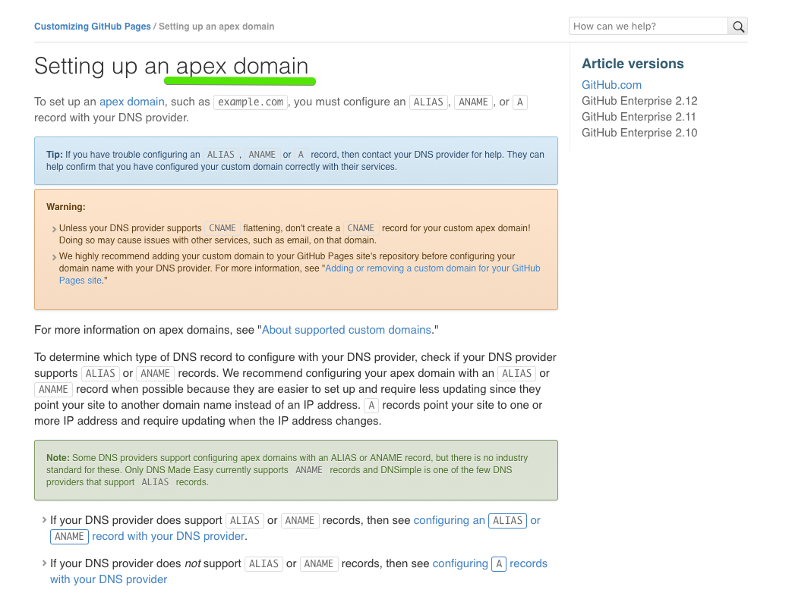
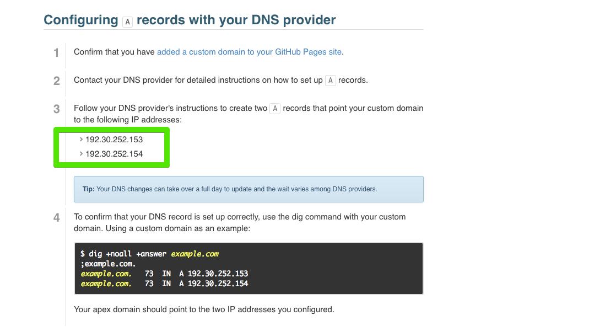

### step 4. 활성화를 위해 Nameserver 설정하기

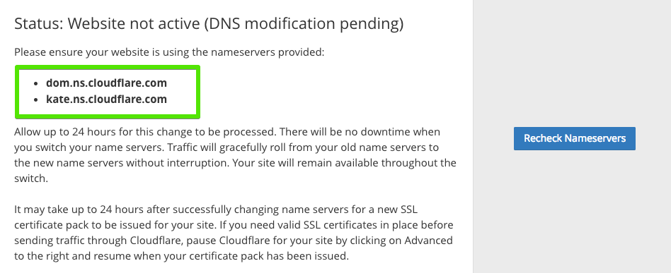
- Continue를 누르면 Nameserver를 변경하라는 이런 비슷한 종류의 메세지가 뜬다.
- 이 두개의 주소를 기억해 두었다가 도메인을 구입한 서비스로 이동해 업데이트를 해주면 된다. (다음 단계)

### step 5. 네임서버를 업데이트한다.
Cloudflare에 연결이 끝나면, 이제 도메인을 구입한 서비스 사이트(goDaddy, Namecheap등)로 가서 Nameserver를 Cloudflare로 업데이트 해주는 작업이 필요하다. 

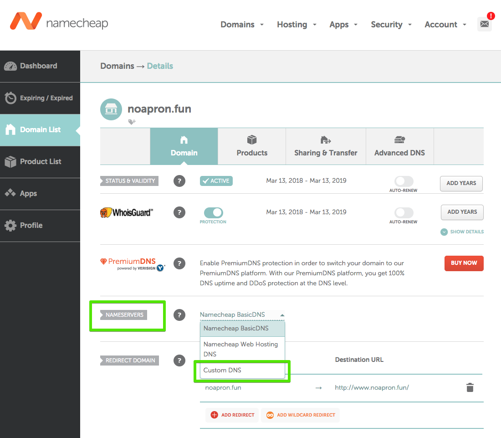
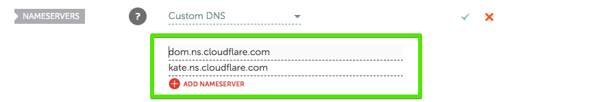

- 도메인 세팅 페이지로 이동해 `Nameserver` 세팅하는 곳을 찾는다. 여기서 `Custom DNS`를 선택한다.
- 이렇게 하면 다른 곳에서 구매한 도메인도  Cloudflare에서 관리할 수 있게 된다.

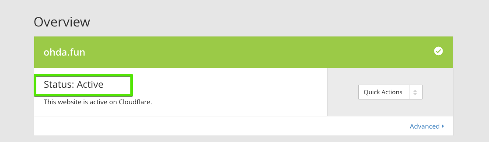
- 잠시 후 Cloudflare로 이동해 확인 해보면 status가 **active**로 바뀐것을 확인할 수 있다. (시간이 걸릴 수도 있음)

### step 6. Cloudflare에서 각종 설정하기
이제 https로의 연결이 잘 되었으면 redirect해주는 기능을 설정해보자.
Cloudflare에서는 http로  접속했을 경우 자동으로 https로 연결해 주는 기능을 제공한다.

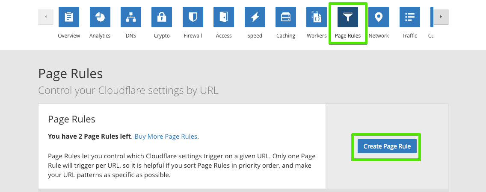
- Cloudflare에서 `Page Rules`메뉴로 이동한다.
- `Create Page Rule`를 선택해 새로운 룰을 만들어 보자.

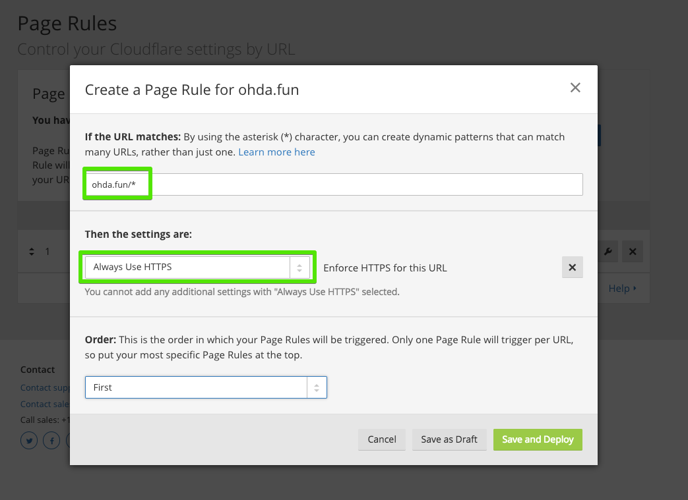
- `도메인 주소/*` 를 입력해 모든 페이지에서 동작하게 할 수 있다.
- 세팅에서 `Always Use HTTPS`를 선택한다.

- - - -
일부 인증서의 경우 expiration date가 있어서 미리미리 갱신을 해줘야 하는데 아직까지 알아본 바에 의하면 Cloudflare에서는 자동으로 알아서 갱신을 제공해주는 것 같다. Cloudflare에 보면 무료 버전으로도 일반 블로그에서 관리하기엔 충분한 다양한 서비스들을 제공하니 https 인증 목적 외에도 사용하기 좋은 서비스인 것 같다.

나에게 도움을 준 사이트
- [An Illustrated Guide for Setting Up Your Website Using Github & Cloudflare](https://medium.freecodecamp.org/an-illustrated-guide-for-setting-up-your-website-using-github-cloudflare-5a7a11ca9465)

- - - -

